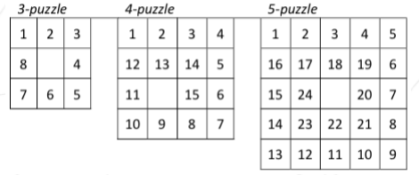

# N-Puzzle
## Aidan Sullivan
________________________

### A Python program that solves an n-puzzle
See: https://en.wikipedia.org/wiki/15_puzzle
Size of the puzzle is n*n


### Usage
```usage: npuzzle [-h] [-d HEURISTIC] [-s {g,u,greedy,uniform}] <inputfile>

Solve N-puzzles

positional arguments:
  <inputfile>           Puzzle text file to be solved

optional arguments:
  -h, --help            show this help message and exit
  -d HEURISTIC, --heuristic HEURISTIC
                        manhattan (default), hamming, euclidean
  -s {g,u,greedy,uniform}, --search {g,u,greedy,uniform}

